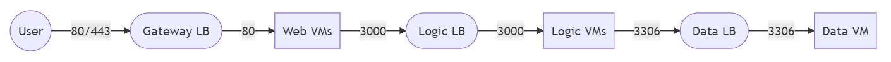

# Three Tier Azure Infra

This repository contains the terraform code responsible for creating classic three tier setup.

## Prerequisites

1. Azure account
2. Azure CLI
3. Az login
4. Terraform
5. public key and private key for VMs at ./compute/vm-access.pem amd ./compute/vm-access.pub

## Approach

1. User sends a request to a LB in `gateway` subnet which accepts traffic on port `80`
2. Request is then routed to `web` VMs in `web` subnet
3. `Web` VMs then sends requests to `Logic` LB in `logic` subnet on port 3000
4. `Logic` VMs then queries a DB instance in `data` subnet through `data` LB on port `3306`

## Considerations

1. VMs in vnet are only accesible from Bastion Hosts
2. Subnets are locked down to accept traffic from intended subnets only

## Design and Request Flow



<!---
```mermaid
graph LR
  A((User)) -- |80/443| B([Gateway LB])
  B --  |80| C[Web VMs]
  C -- |3000| D([Logic LB])
  D -- |3000| E[Logic VMs]
  E -- |3306| G([Data LB])
  G -- |3306| H[Data VM]
---->

## Technical Design

### High Level


Create Azure Diagram with [AzViz](https://github.com/PrateekKumarSingh/AzViz)

### Low Level


Create Azure Diagram with [AzViz](https://github.com/PrateekKumarSingh/AzViz)

## Resources


## Useful Commands

```bash
# module initialisation
terraform init

# format code
terraform format

# validate code
terraform validate

# apply
terraform apply

# destroy
terraform destroy
```
